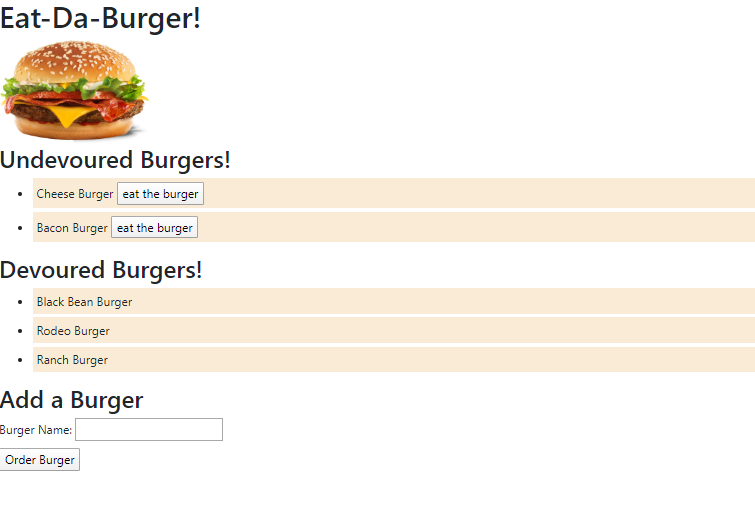

# README-Burger APP

# Repository Github link

The Github Repo is at: [https://github.com/Andrewjhrussell/burger.git](https://github.com/Andrewjhrussell/burger.git)

# Deploy Heroku link

The Heroku App is located at: [https://frozen-hollows-18077.herokuapp.com/](https://frozen-hollows-18077.herokuapp.com/)

# Title:

Burger App

# Badges

# Description

In this assignment, I create a burger logger with MySQL, Node, Express, Handlebars and a homemade ORM . This App has the following MVC design pattern; use Node and MySQL to query and route data in your app, and Handlebars to generate your HTML.

# Table of contents

Title, Description, Table Of Content, Installion, Usage, License, Contribution Test, Question, Demo

# Installation

MySQL, Heroku, Node,

# Usage

This Website lets users input the names of burgers they'd like to eat.

* Whenever a user submits a burger's name, your app will display the burger on the left side of the page -- waiting to be devoured.

* Each burger in the waiting area also has a `Devour it!` button. When the user clicks it, the burger will move to the right side of the page.

* Your app will store every burger in a database

# License

MIT License

Copyright (c) 2020 Andrew Russell

Permission is hereby granted, free of charge, to any person obtaining a copy of this software and associated documentation files (the "Software"), to deal in the Software without restriction, including without limitation the rights to use, copy, modify, merge, publish, distribute, sublicense, and/or sell copies of the Software, and to permit persons to whom the Software is furnished to do so, subject to the following conditions:

The above copyright notice and this permission notice shall be included in all copies or substantial portions of the Software.

THE SOFTWARE IS PROVIDED "AS IS", WITHOUT WARRANTY OF ANY KIND, EXPRESS OR IMPLIED, INCLUDING BUT NOT LIMITED TO THE WARRANTIES OF MERCHANTABILITY, FITNESS FOR A PARTICULAR PURPOSE AND NONINFRINGEMENT. IN NO EVENT SHALL THE AUTHORS OR COPYRIGHT HOLDERS BE LIABLE FOR ANY CLAIM, DAMAGES OR OTHER LIABILITY, WHETHER IN AN ACTION OF CONTRACT, TORT OR OTHERWISE, ARISING FROM, OUT OF OR IN CONNECTION WITH THE SOFTWARE OR THE USE OR OTHER DEALINGS IN THE SOFTWARE.

# Contribution

Andrew Russell

# Test

Travis CI

# If you have any questions email us @

Andrewjhrussell@gmail.com
 
